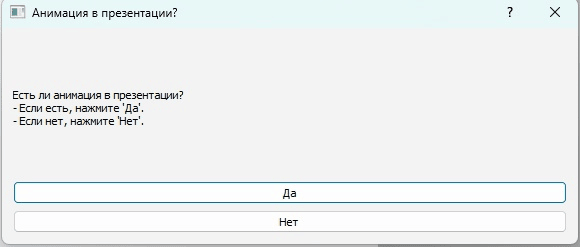
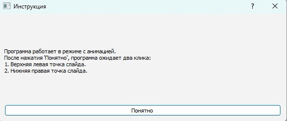
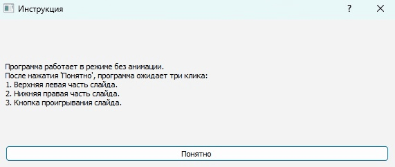
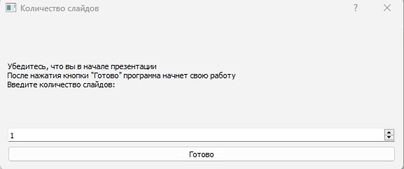

# Программа для скриншота презентаций

## Описание
Это программа позволяет автоматически создавать презентации из скриншотов слайдов. Идеальна при учебе/работе на платформах с презентациями пакета SCORM. 

Она поддерживает два режима работы:
- **Режим с анимацией**: Для слайдов с анимацией (требует ручного сохранения каждого слайда).
- **Режим без анимации**: Для слайдов без анимации (автоматически делает скриншоты всех слайдов).

---

## Функционал
- **Выбор режима работы**:
  - При запуске программы пользователю предлагается выбрать режим: "с анимацией" или "без анимации".
  
- **Настройка области захвата**:
  - В обоих режимах нужно указать область экрана, где находится слайд.

- **Режим с анимацией**:
  - Нажмите `E`, чтобы сделать скриншот текущего слайда.
  - Нажмите `S`, чтобы сохранить все сделанные скриншоты в документ Word или PDF.
  - Нажмите `Q` для принудительного выхода из программы.

- **Режим без анимации**:
  - Укажите количество слайдов.
  - Программа автоматически сделает скриншоты всех слайдов и сохранит их в документ.
  - Для принудительного выхода из программы нажмите `Q`.

---

## Как использовать

### **Установка**
1. Скачайте `.exe` файл из репозитория.
2. Запустите программу.

### **Инструкции**
1. **Выбор режима**:
   - При запуске программы выберите режим: "с анимацией" или "без анимации".

2. **Настройка области захвата**:
   - В режиме **с анимацией**:
     - Сделайте два клика мыши, чтобы указать верхнюю левую и нижнюю правую точки слайда.
   - В режиме **без анимации**:
     - Сделайте три клика мыши:
       - Верхняя левая точка слайда.
       - Нижняя правая точка слайда.
       - Кнопка для перехода к следующему слайду.

3. **Работа в режиме с анимацией**:
   - Нажмите `E`, чтобы сделать скриншот текущего слайда.
   - Нажмите `S`, чтобы сохранить все сделанные скриншоты.
   - Нажмите `Q`, чтобы выйти из программы.

4. **Работа в режиме без анимации**:
   - Введите количество слайдов.
   - Программа автоматически сделает скриншоты всех слайдов.
   - После завершения нажмите `Q`, чтобы выйти.

5. **Сохранение документа**:
   - Выберите формат сохранения: DOCX или PDF.
   - Укажите путь для сохранения файла.

---

## Требования
- Windows 10/11
- Python 3.8+
- Библиотеки:
  - PyQt5
  - pynput
  - pyautogui
  - python-docx
  - win32com.client
  - PIL (Pillow)

---

## Техническая информация

### **Ключевые компоненты**
- **GUI**: Реализовано с помощью PyQt5.
- **Обработка событий клавиатуры и мыши**: Используются библиотеки `pynput` и `keyboard`.
- **Создание документов**: Используется `python-docx` для создания DOCX-файлов и `win32com.client` для преобразования в PDF.

### **Логирование**
Программа использует логгер для записи действий пользователя и ошибок в консоль.

---

## Скриншоты

*Выбор режима работы*

*Информационное окно в режиме с анимацией*

*Информационное окно с подсказками*

*Информационное окно в режиме без анимации*

*Настройка количества слайдов в режиме без анимации*

---

## Авторы
- **GladeK0ff**
- Email: lagermottv@gmail.com

---

## Лицензия
Этот проект распространяется под лицензией MIT. Подробнее см. [LICENSE](LICENSE).

---

## TODO
- Оптимизировать производительность при большом количестве слайдов.
- Добавить возможность пользования программой на других ОС
- Фикс всевозможных (а они будут) багов и недочетов. По этим и другим вопросам обращаться на почту. Не факт, что я этим займусь, но обратная связь есть обратная связь